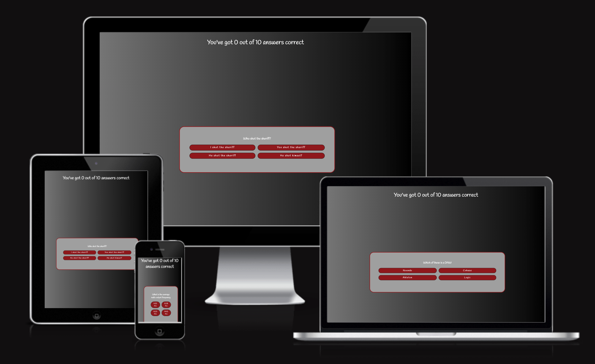
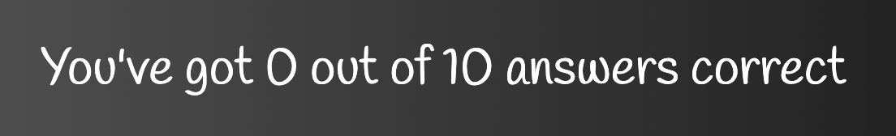
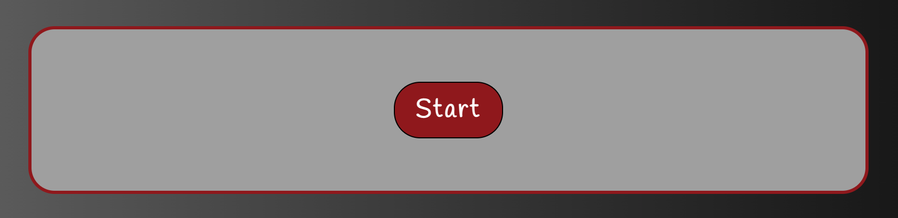
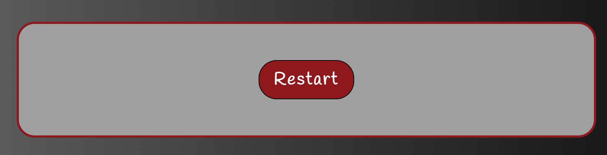
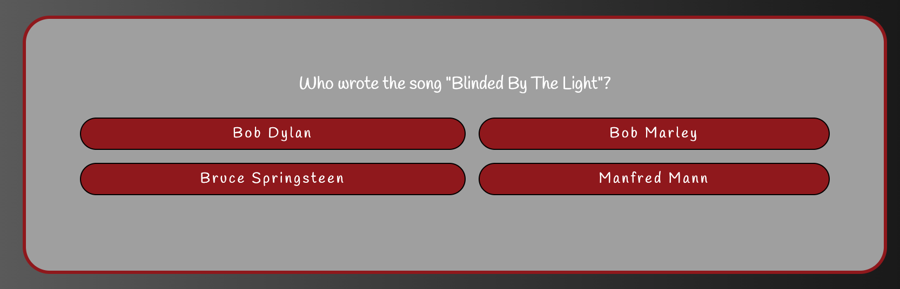
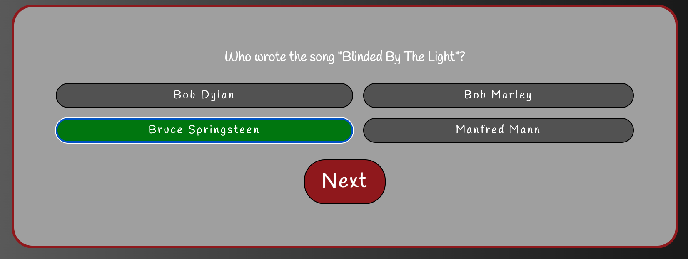

# Music Quiz

## Main Purpose

The main purpose of this quiz is to engage musically interested persons in a different, more challenging quiz than the majority of musical quiz's available at the moment. 
It's meant for having a good time and at the same time educate the user about a wide range of musical information that varies in difficulty. The user interface is designed to make it easy for the user to start the quiz without instructions or further information about the topic.

The site has been created as a milestone project for the Code Institute's Diploma in Full Stack Software Development program.

Required technologies are: HTML5, CSS3 and JavaScript

A live version of the website can be found here: 

## Content

+ [UX](#UX 'UX')
+ [Target Audience](#target-audience 'Target Audience')
+ [User stories](#user-stories 'User stories')
    + [New Users](#new-users 'New Users')
    + [Experienced Users](#experienced-users 'Experienced Users')
    + [Goal](#goal 'Goal')
    + [Requirements](#requirements 'Requirements')
+ [Design](#design 'Design')
    + [Typography](#typography 'Typography')
    + [Color Palette](#color-palette 'Color Palette')
    + [Different screens](#different-screens 'Different screens')
    + [Images](#images 'Images')
    + [Structure](#structure 'Structure')
+ [Future development](#future-development 'Future development')
+ [Technologies used](#technologies-used 'Technologies used')
    + [Languages ](#languages  'Languages ')
    + [Deployment](#deployment 'Deployment')
    + [Content](#content 'Content')
    + [Media](#media 'Media')
    + [bugs](#bugs 'bugs')
    + [Credits](#credits 'Credits')
## UX

### Target Audience

* The quiz targets any individual wanting to have a fun time and possibly learn something interesting along the way. Everyone can take the quiz but you need to posess a wide range of musical knowledge to score high on the first try.

### User stories
#### New Users
* I want a quiz that is more than just guessing songs.
* I want to improve my knowledge about music.
* I want to challange myself in musical knowledge.
* I want to score 10 out of 10.

#### Experienced Users
* I want to improve my score.
* I want to know more about this topic.

#### Goal
* I want to get 10 out of 10 right answers.

#### Requirements
* To build an interactive front-end site that responds to user actions. The user should engage actively by altering data and how the site displays. The development process needs to be well documented through a version controls system such as GitHub and contain HTML5, CSS3 and JavaScript.

### Design
The design is simple to keep the user focused on the quiz without unnecessary distractions. When clicking an answer, all the wrong answers turns grey and the correct answer(s) turns green.
Start Quiz

#### Typography
* I used google fonts 'Handlee' font to increase the sensation of playfulness to the website.
* I used Sans-serfi as a backup for users that may have browsers not supporting google fonts.

#### Color Palette
* There are only '' colors on the palette, chosen from personal preference to make a simple look and make text readable without unnecessary distractions.
* The background is gradient going left to right, grey to black to make the design more sophisticated.

#### Different screens
* The website is fully responsive to fit all screen sizes.

#### Images
* The image on top of this README.md file is created by https://ui.dev/amiresponsive.

#### Structure

* Score Counter

* Start/Restart is the same layout with different text in the button element depending on whether to Start a new quiz, or restart the quiz after finishing.

Start

Restart

* Quiz layout shows a question box with 4 different options to choose from.

* Wrong answers turns grey and correct answer turns green when clicking an option.

### Future development
* The website is going to have more quiz's with a focus on wide range knowledge of topics that can challenge well educated users.

### Technologies used

#### Languages 

* HTML5
' add jigsaw w3 HTML validation picture as proof'
* CSS3
' add jigsaw w3 CSS validation img as proof'
* JavaScript
'add jshint validation img as proof'

#### Deployment

<ol>
<li>Go to https://www.github.com</li>
<li>Log in</li>
<li>Go to 'My Repositories'</li>
<li>Choose 'milestone-project-2'</li>
<li>Go to 'settings'</li>
<li>Go to 'pages'</li>
<li>Choose 'deploy from a branch'</li>
<li>Choose 'main branch'</li>
</ol>

#### Content

* Questions and answers were known by heart.

#### Media
* Google fonts.

### bugs
<ul>
<li><em>Bug 1</em></li>
<ul>
<li>Error: cannot read properties of undefined forEach line 26.</li>
<li>Fix: spell "answer" instead of "answers" in questions array</li>
</ul>
<li>Bug 2</li>
<ul>
<li>Error: Question container turns grey and dysfunctional after all questions are finished.</li>
<li>Fix: Add restart button to restart quiz at the end.</li>
</ul>
<li>Bug 3 (Unfixed)</li>
<ul>
<li>Score counter doesn't restart</li>
</ul>
</ul>

### Credits

* web dev simplified
* W3 school
* Stack overflow
* My mentor Martina Terlevic

